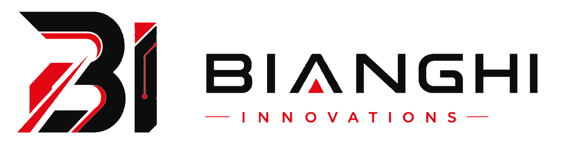
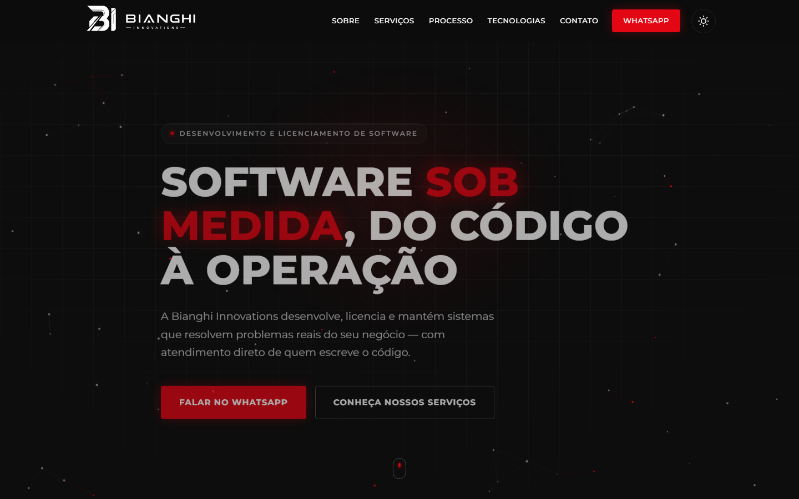
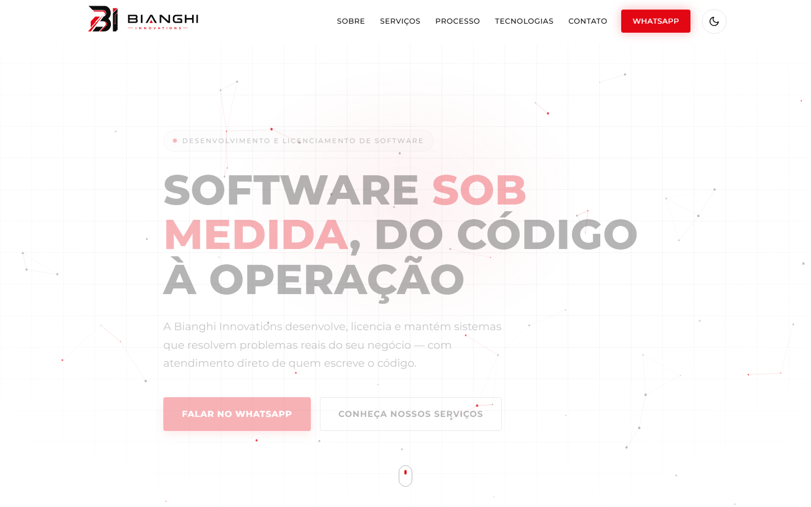
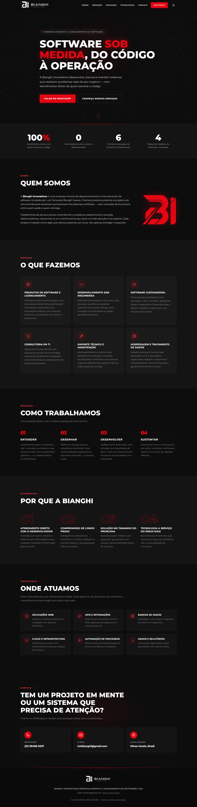
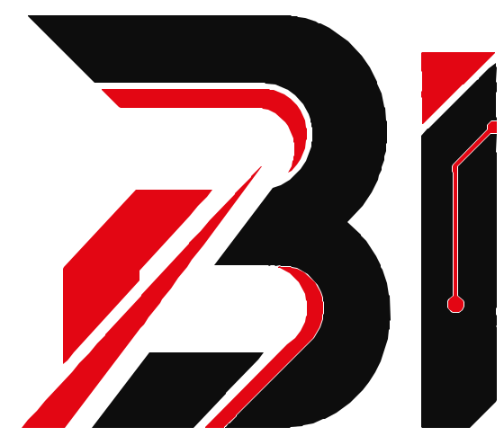

<div align="center">

<picture>
  <source media="(prefers-color-scheme: dark)" srcset="site/assets/img/bianghi_logo_horizontal_white.svg">
  
</picture>

<br>

### Software sob medida, do código à operação.

Site institucional da **Bianghi Innovations**, empresa mineira de desenvolvimento e licenciamento de software.<br>
Uma landing page de página única, feita em **HTML, CSS e JavaScript puros**, sem build e sem dependências.

<br>


[](https://luizbianghideveloper.github.io/BianghiInnovations/)

<br>

[**🌐 Ver o site**](https://luizbianghideveloper.github.io/BianghiInnovations/) &nbsp;·&nbsp; [**💬 WhatsApp**](https://wa.me/5531994980237) &nbsp;·&nbsp; [**✉️ E-mail**](mailto:luizbianghi@gmail.com) &nbsp;·&nbsp; [**🚀 Rodar localmente**](#-como-rodar-localmente) &nbsp;·&nbsp; [**🎨 Design system**](#-design-system)

</div>

<br>

## 🖼️ Prévia

<table>
  <tr>
    <td align="center"><strong>🌑 Tema escuro (padrão da marca)</strong></td>
    <td align="center"><strong>☀️ Tema claro</strong></td>
  </tr>
  <tr>
    <td></td>
    <td></td>
  </tr>
</table>

<details>
  <summary><strong>📜 Ver a página inteira</strong></summary>
  <br>
  <p align="center">
    
  </p>
</details>

<br>

## ✨ Destaques

<table>
  <tr>
    <td width="50%" valign="top">
      <h4>🌗 Tema claro/escuro persistente</h4>
      O alternador no header salva a escolha em <code>localStorage</code>. Um script inline no <code>&lt;head&gt;</code> aplica o tema salvo antes do primeiro paint, sem "flash" do tema errado. Abas abertas acompanham a troca.
    </td>
    <td width="50%" valign="top">
      <h4>⚡ Zero dependências, zero build</h4>
      Nenhum framework, bundler ou pré-processador. O que está em <code>site/</code> é exatamente o que vai para o servidor. Basta abrir ou servir a pasta.
    </td>
  </tr>
  <tr>
    <td width="50%" valign="top">
      <h4>♿ Acessível de verdade</h4>
      Marcação semântica, <code>aria-*</code> nos controles, foco visível, contraste AA calibrado por tema e respeito a <code>prefers-reduced-motion</code>. Sem JavaScript, todo o conteúdo continua visível.
    </td>
    <td width="50%" valign="top">
      <h4>🎬 Movimento com propósito</h4>
      Partículas em <code>&lt;canvas&gt;</code> no hero, animações de entrada por <code>IntersectionObserver</code> e contadores na faixa de números. Tudo pausa fora da viewport e desliga com movimento reduzido.
    </td>
  </tr>
  <tr>
    <td width="50%" valign="top">
      <h4>📱 Mobile-first</h4>
      Layout fluido com breakpoints em 768px, 900px e 1200px, menu hambúrguer acessível e ajuste para telas abaixo de 360px.
    </td>
    <td width="50%" valign="top">
      <h4>🔎 Pronto para compartilhar</h4>
      Meta <code>description</code>, Open Graph, <code>theme-color</code> por tema, favicon em SVG e ICO, ícone para iOS e manifesto com ícones de 192px e 512px para Android.
    </td>
  </tr>
</table>

<br>

## 🚀 Como rodar localmente

Não há instalação. Abrir `site/index.html` no navegador já funciona, mas servir a pasta por HTTP deixa o comportamento igual ao de produção (tema salvo, fontes, cache).

```bash
# Com Python
cd site
python -m http.server 8765 --bind 127.0.0.1

# Ou com Node
npx serve site
```

Depois acesse `http://127.0.0.1:8765` (ou a porta informada pelo comando).

<br>

## 🗂️ Estrutura do projeto

```
BianghiInnovations/
├── README.md
├── .github/workflows/pages.yml    # deploy automático no GitHub Pages
├── docs/                          # capturas de tela usadas neste README
└── site/                          # raiz pública do site (é isso que vai para o servidor)
    ├── index.html                 # página única, todas as seções
    ├── site.webmanifest           # nome, cores e ícones para Android / instalação como app
    ├── conteudo.md                # texto-fonte de todas as seções (copy do site)
    ├── css/
    │   ├── styles.css             # estilos base + tema escuro (padrão)
    │   └── styles-light.css       # camada do tema claro, escopada em [data-theme="light"]
    ├── js/
    │   └── main.js                # menu mobile, tema, animações, contadores, partículas
    └── assets/
        ├── icons/                 # favicon.ico, favicon.svg, apple-touch-icon e app_icon de 16px a 512px
        └── img/                   # logos (horizontal, vertical, símbolo) em SVG e PNG
```

<br>

## 🧭 Seções do site

Na ordem em que aparecem em `index.html`:

| # | Seção | Âncora | O que traz |
|:-:|-------|--------|------------|
| 1 | **Hero** | `#inicio` | Headline, subheadline e CTAs para WhatsApp e serviços |
| 2 | **Números** | `#numeros` | Faixa de estatísticas. Só entram afirmações verdadeiras; métricas reais substituem os valores atuais quando existirem |
| 3 | **Sobre** | `#sobre` | Quem é a Bianghi e como trabalha |
| 4 | **Serviços** | `#servicos` | Seis cards: produtos e licenciamento, sob encomenda, customizável, consultoria, suporte, hospedagem e dados |
| 5 | **Processo** | `#processo` | Quatro etapas: Entender, Desenhar, Desenvolver, Sustentar |
| 6 | **Diferenciais** | `#diferenciais` | Quatro argumentos de valor |
| 7 | **Tecnologias** | `#tecnologias` | Seis **domínios de atuação** (Web, APIs, bancos de dados, cloud, automação, dados). Não é lista de linguagens porque o stack oficial ainda não foi definido; cada card é independente e pode ser trocado |
| 8 | **Contato** | `#contato` | WhatsApp, e-mail e localização |
| 9 | **Footer** | | Razão social, CNPJ e copyright |

<br>

## 🎨 Design system

Os tokens ficam em `:root` no `styles.css` e são redefinidos em `:root[data-theme="light"]` no `styles-light.css`. Layout, tipografia, espaçamentos e breakpoints vêm apenas do `styles.css`; a camada clara só mexe em cor.

| Token | Tema escuro | Tema claro |
|-------|:-----------:|:----------:|
| `--fundo-0` |  |  |
| `--fundo-1` |  |  |
| `--fundo-2` |  |  |
| `--vermelho` |  |  |
| `--vermelho-claro` <sub>(texto pequeno, AA)</sub> |  |  |
| `--texto` |  |  |
| `--texto-suave` |  |  |

- **Tipografia:** Montserrat (Google Fonts) nos pesos 400, 500, 700 e 800, com fallback para Segoe UI e Arial.
- **Breakpoints (mobile-first):** `768px`, `900px` (navegação passa a horizontal) e `1200px`, mais um ajuste abaixo de `360px`.
- **Contraste:** o vermelho `#E30613` puro só passa AA em texto grande. Para texto pequeno use `--vermelho-claro`, já calibrado para cada tema.
- **Logos por tema:** header e footer carregam duas versões (`logo--escuro` e `logo--claro`) e o CSS exibe só a do tema ativo.

<br>

## ✏️ Como editar o conteúdo

| Quero mudar… | Onde |
|--------------|------|
| **Textos das seções** | `site/conteudo.md` é a fonte de verdade da copy. Atualize o markdown e o trecho correspondente em `index.html` |
| **WhatsApp e e-mail** | O link do WhatsApp aparece no menu, no hero e na seção de contato de `index.html`. O e-mail fica na seção de contato |
| **Faixa de números** | Cada item tem `data-contagem` com o valor final e o mesmo valor como texto. Altere os dois |
| **Serviços, etapas, diferenciais, domínios** | Cada um é um bloco independente dentro da seção. Duplique ou remova o bloco |
| **Cores** | Tokens em `styles.css` (escuro) e `styles-light.css` (claro) |
| **Razão social, CNPJ, copyright** | No `<footer>` de `index.html` |

<br>

## ☁️ Deploy

O site é publicado automaticamente no **GitHub Pages** a cada push na branch `main`, pelo workflow em `.github/workflows/pages.yml`. Ele empacota a pasta `site/` e faz o deploy, sem etapa de build.

🌐 **https://luizbianghideveloper.github.io/BianghiInnovations/**

Por ser estático, o site também roda em qualquer outra hospedagem de arquivos: Netlify, Vercel, Cloudflare Pages, Amazon S3 ou um servidor web comum (Nginx, Apache). A pasta a publicar é sempre **`site/`**.

<br>

## 📄 Licença

Código, textos, marca e identidade visual são de propriedade da **Bianghi Innovations Desenvolvimento e Licenciamento de Softwares LTDA** (CNPJ 58.767.885/0001-39). Todos os direitos reservados.

<br>

<div align="center">

<picture>
  <source media="(prefers-color-scheme: dark)" srcset="site/assets/img/bianghi_symbol_white.svg">
  
</picture>

**Bianghi Innovations** · Minas Gerais, Brasil

[💬 (31) 99498-0237](https://wa.me/5531994980237) &nbsp;·&nbsp; [✉️ luizbianghi@gmail.com](mailto:luizbianghi@gmail.com)

</div>
